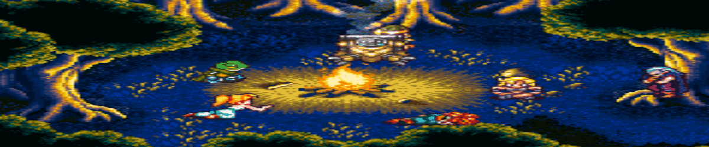

  

<h1 align="center">🌿 Ana Luiza</h1>

  <em>Entusiasta de hardware e apaixonada por RPG.</em>

## 🛠️ Atualmente trabalhando em...

- 🍹 **Go Drinking!** — Plataforma de gestão de eventos e Open Bar com controle de estoque de alta precisão. Atuo no **design (UX/UI)** e no **front-end**.
- 🎨 **UX/UI no Figma** — Aplicando os meus estudos em UX/UI.
- 🐍 **Python** — Estudando para ampliar meus conhecimentos.
- 📚 Construindo projetos e evoluindo constantemente.

## 🚀 Tech Stack

  
  
  
  
  
  
  

  <i>"O sol sempre se erguerá"</i> ☀️

